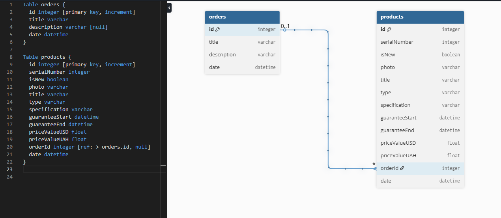

# Orders & Products SPA

SPA-приложение для управления заказами (Orders) и продуктами (Products), реализованное с использованием React, Redux, TypeScript и других современных технологий.  
Проект построен с использованием архитектурного подхода FSD (Feature-Sliced Design), поддерживает WebSocket для подсчёта активных сессий, анимации, валидацию форм и адаптивную верстку.

---

## 🚀 Технологический стек

- React 19 — основа SPA
- TypeScript — статическая типизация для надежности кода
- Redux Toolkit — управление глобальным состоянием
- React Router Dom — маршрутизация между страницами
- React Hook Form — управление формами и их валидация
- Framer Motion — анимации переходов и эффектов
- Bootstrap + React Bootstrap — UI и стилизация по БЭМ
- Socket.IO — WebSocket для realtime-счётчика активных сессий
- Prisma ORM + SQLite — база данных и удобная работа с ней
- ESLint + Prettier — стандартизация кода и автоформатирование
- Vitest + Testing Library — юнит-тестирование компонентов и утилит
- Vite — быстрый билдер и дев-сервер

---

## 🏗 Архитектура проекта

Применён подход Feature-Sliced Design (FSD) с разбивкой кода по слоям:

- app/ — корневые конфигурации и точки входа
- entities/ — модели данных и связанная логика
- features/ — конкретные функции и бизнес-логика
- pages/ — страницы
- processes/ — крупные процессы и сценарии работы приложения
- shared/ — переиспользуемые утилиты, компоненты и хелперы
- widgets/ — объединённые UI-компоненты

Применён подход barrel-pattern

## ⚙️ Функционал

- Навигация по страницам Orders и Products с помощью React Router
- Отображение заказов и продуктов с фильтрацией по типу продуктов
- Подробная информация по заказу и его продуктам с возможностью разворачивания/сворачивания
- Подсчёт активных сессий пользователей в реальном времени с помощью WebSocket
- Формы добавления и редактирования с валидацией на React Hook Form
- Анимации при переключении страниц и компонентов с помощью Framer Motion
- Ленивая загрузка компонентов и изображений для оптимизации производительности
- Поддержка TypeScript на всём протяжении проекта
- Покрытие тестами функций (Vitest)
- Использование Prisma ORM для работы с базой данных SQLite

---

## 🛠 Запуск проекта

1. Клонировать репозиторий:

   ```bash
   git clone https://github.com/Vadym-Mishchenko/orders-products-dzencode-test-task.git
   cd orders-products-dzencode-test-task
   ```

2. Установить зависимости:

   ```bash
   npm install
   ```

3. Запустить клиент:

   ```bash
   npm run dev
   ```

4. Запустить сервер:

   ```bash
   npm run build-server
   npm run start-server
   ```

5. Запуск тестов:

   ```bash
   npm test
   ```

---

## 🗄 Схема базы данных

Используется Prisma ORM с базой данных SQLite

Модели: Order и Product, связанные отношением один-ко-многим

Файл схемы БД (`schema.prisma`) находится в корне проекта

Можно открыть схему и структуру БД в MySQL Workbench или аналогичных инструментах с поддержкой SQLite или через [dbdiagram.io](https://dbdiagram.io)



---

## ✍️ Автор

Vadym Mishchenko  
GitHub: https://github.com/Vadym-Mishchenko
